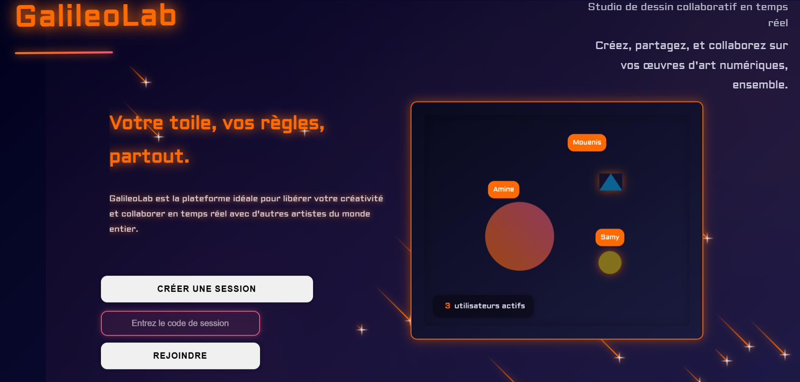
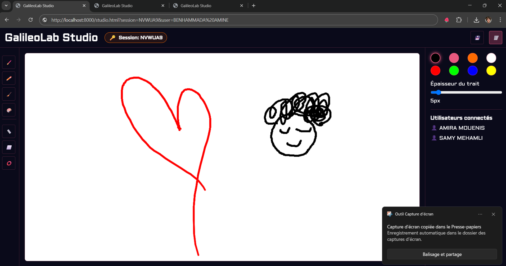
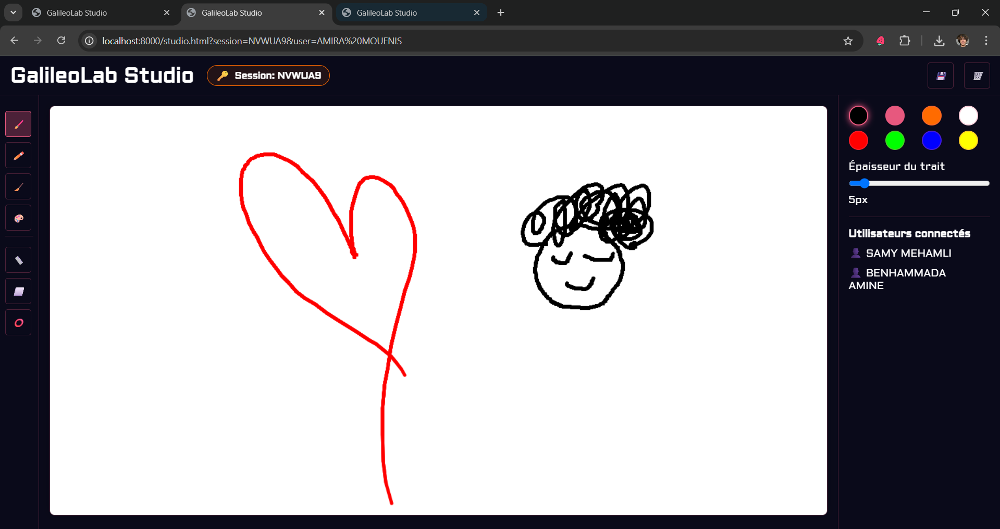

# 🎨 GalileoLab - Studio de Dessin Collaboratif en Temps Réel

<div align="center">
  
  
  
  
</div>

<details>
<summary>🇫🇷 Français</summary>

## 📋 Table des Matières
- [À Propos](#-à-propos)
- [✨ Fonctionnalités](#-fonctionnalités)
- [🖼️ Captures d'Écran](#️-captures-décran)
- [🛠️ Technologies Utilisées](#️-technologies-utilisées)
- [🚀 Installation](#-installation)
- [💻 Utilisation](#-utilisation)
- [🔧 Configuration](#-configuration)
- [📝 Structure du Projet](#-structure-du-projet)
- [🤝 Contribution](#-contribution)
- [📄 Licence](#-licence)

## 🌟 À Propos

GalileoLab est une application web innovante de dessin collaboratif en temps réel, permettant aux utilisateurs de créer et de partager des œuvres d'art numériques de manière interactive. Inspirée par l'esprit de collaboration et de créativité, GalileoLab offre une expérience unique de création artistique collective.

## ✨ Fonctionnalités

### 🎯 Fonctionnalités Principales
- **Dessin en Temps Réel** : Collaboration instantanée avec plusieurs utilisateurs
- **Outils de Dessin Avancés** :
  - Pinceau et crayon avec ajustement de l'épaisseur
  - Gomme pour les corrections
  - Aérographe pour des effets spéciaux
  - Formes géométriques (lignes, rectangles, cercles)
- **Gestion des Sessions** :
  - Création de sessions uniques
  - Rejoindre des sessions existantes via code
  - Suivi des utilisateurs connectés
- **Interface Intuitive** :
  - Palette de couleurs personnalisable
  - Contrôles d'outils facilement accessibles
  - Notifications en temps réel

### 🔄 Fonctionnalités Collaboratives
- Synchronisation instantanée des dessins
- Affichage des utilisateurs actifs
- Historique des modifications

## 🖼️ Captures d'Écran

### Page d'Accueil
<div align="center">
  
  <p><em>Interface moderne et intuitive de la page d'accueil</em></p>
</div>

### Collaboration en Temps Réel
<div align="center">
  
  <p><em>Première vue de la collaboration en temps réel</em></p>
</div>

<div align="center">
  
  <p><em>Deuxième vue de la collaboration en temps réel</em></p>
</div>

<div align="center">
  
  <p><em>Troisième vue de la collaboration en temps réel</em></p>
</div>

## 🛠️ Technologies Utilisées

### Backend
-  PHP 7.4+
-  Ratchet WebSocket
-  Composer

### Frontend
-  HTML5
-  CSS3
-  JavaScript
-  Canvas API

## 🚀 Installation

### Prérequis
- PHP 7.4 ou supérieur
- Composer
- Serveur web (Apache/Nginx)
- Extension PHP WebSocket

### Étapes d'Installation

1. **Cloner le Repository**
```bash
   git clone https://github.com/KESHRUD/GalileoLab.git
   cd GalileoLab
```

2. **Installer les Dépendances**
```bash
composer install
```

3. **Configurer les Permissions**
   ```bash
   chmod -R 777 logs/
   ```

4. **Démarrer le Serveur WebSocket**
```bash
php php/ws-server.php
```

5. **Configurer le Serveur Web**
   - Assurez-vous que votre serveur web pointe vers le répertoire du projet
   - Activez le module rewrite si vous utilisez Apache

## 💻 Utilisation

1. **Accéder à l'Application**
   - Ouvrez votre navigateur et accédez à `http://localhost:8000/`

2. **Créer une Session**
   - Cliquez sur "Créer une session"
   - Choisissez votre nom d'utilisateur
   - Partagez le code de session avec vos collaborateurs

3. **Rejoindre une Session**
   - Entrez le code de session fourni
   - Choisissez votre nom d'utilisateur
   - Commencez à dessiner !

## 🔧 Configuration

### Configuration du Serveur WebSocket
Le serveur WebSocket est configuré par défaut pour écouter sur le port 8080. Pour modifier ce paramètre, éditez le fichier `php/ws-server.php`.

### Configuration des Logs
Les logs sont stockés dans le répertoire `logs/` :
- `connections.json` : Historique des connexions
- `drawings.json` : Sauvegardes des dessins
- `errors.json` : Journal des erreurs
- `sessions.json` : Informations sur les sessions

## 📝 Structure du Projet

```
GalileoLab/
├── css/
│   ├── animations.css
│   ├── studio.css
│   └── style.css
├── js/
│   ├── landing.js
│   └── studio.js
├── logs/
│   ├── connections.json
│   ├── drawings.json
│   ├── errors.json
│   └── sessions.json
├── php/
│   ├── logger.php
│   ├── session.php
│   └── ws-server.php
├── vendor/
├── composer.json
├── composer.lock
├── index.html
├── README.md
└── studio.html
```

## 🤝 Contribution

Les contributions sont les bienvenues ! Pour contribuer :

1. Fork le projet
2. Créez une branche pour votre fonctionnalité (`git checkout -b feature/AmazingFeature`)
3. Committez vos changements (`git commit -m 'Add some AmazingFeature'`)
4. Push vers la branche (`git push origin feature/AmazingFeature`)
5. Ouvrez une Pull Request

## 📄 Licence

Ce projet est sous licence MIT. Voir le fichier `LICENSE` pour plus de détails.

</details>

<details>
<summary>🇬🇧 English</summary>

## 📋 Table of Contents
- [About](#about)
- [✨ Features](#features)
- [🖼️ Screenshots](#screenshots)
- [🛠️ Technologies Used](#technologies-used)
- [🚀 Installation](#installation)
- [💻 Usage](#usage)
- [🔧 Configuration](#configuration)
- [📝 Project Structure](#project-structure)
- [🤝 Contributing](#contributing)
- [📄 License](#license)

## 🌟 About

GalileoLab is an innovative real-time collaborative drawing web application that allows users to create and share digital artwork interactively. Inspired by the spirit of collaboration and creativity, GalileoLab offers a unique collective artistic creation experience.

## ✨ Features

### 🎯 Main Features
- **Real-time Drawing**: Instant collaboration with multiple users
- **Advanced Drawing Tools**:
  - Brush and pencil with thickness adjustment
  - Eraser for corrections
  - Airbrush for special effects
  - Geometric shapes (lines, rectangles, circles)
- **Session Management**:
  - Unique session creation
  - Join existing sessions via code
  - Connected users tracking
- **Intuitive Interface**:
  - Customizable color palette
  - Easily accessible tool controls
  - Real-time notifications

### 🔄 Collaborative Features
- Instant drawing synchronization
- Active users display
- Modification history

## 🖼️ Screenshots

### Landing Page
<div align="center">
  
  <p><em>Modern and intuitive landing page interface</em></p>
</div>

### Collaboration in Real-time
<div align="center">
  
  <p><em>First view of real-time collaboration</em></p>
</div>

<div align="center">
  
  <p><em>Second view of real-time collaboration</em></p>
</div>

<div align="center">
  
  <p><em>Third view of real-time collaboration</em></p>
</div>

## 🛠️ Technologies Used

### Backend
-  PHP 7.4+
-  Ratchet WebSocket
-  Composer

### Frontend
-  HTML5
-  CSS3
-  JavaScript
-  Canvas API

## 🚀 Installation

### Prerequisites
- PHP 7.4 or higher
- Composer
- Web server (Apache/Nginx)
- PHP WebSocket extension

### Installation Steps

1. **Clone the Repository**
   ```bash
   git clone https://github.com/KESHRUD/GalileoLab.git
   cd GalileoLab
   ```

2. **Install Dependencies**
   ```bash
   composer install
   ```

3. **Configure Permissions**
   ```bash
   chmod -R 777 logs/
   ```

4. **Start WebSocket Server**
   ```bash
   php php/ws-server.php
   ```

5. **Configure Web Server**
   - Ensure your web server points to the project directory
   - Enable rewrite module if using Apache

## 💻 Usage

1. **Access the Application**
   - Open your browser and navigate to `http://localhost:8000/`

2. **Create a Session**
   - Click on "Create Session"
   - Choose your username
   - Share the session code with your collaborators

3. **Join a Session**
   - Enter the provided session code
   - Choose your username
   - Start drawing!

## 🔧 Configuration

### WebSocket Server Configuration
The WebSocket server is configured by default to listen on port 8080. To modify this setting, edit the `php/ws-server.php` file.

### Logs Configuration
Logs are stored in the `logs/` directory:
- `connections.json`: Connection history
- `drawings.json`: Drawing backups
- `errors.json`: Error log
- `sessions.json`: Session information

## 📝 Project Structure

```
GalileoLab/
├── css/
│   ├── animations.css
│   ├── studio.css
│   └── style.css
├── js/
│   ├── landing.js
│   └── studio.js
├── logs/
│   ├── connections.json
│   ├── drawings.json
│   ├── errors.json
│   └── sessions.json
├── php/
│   ├── logger.php
│   ├── session.php
│   └── ws-server.php
├── vendor/
├── composer.json
├── composer.lock
├── index.html
├── README.md
└── studio.html
```

## 🤝 Contributing

Contributions are welcome! To contribute:

1. Fork the project
2. Create your feature branch (`git checkout -b feature/AmazingFeature`)
3. Commit your changes (`git commit -m 'Add some AmazingFeature'`)
4. Push to the branch (`git push origin feature/AmazingFeature`)
5. Open a Pull Request

## 📄 License

This project is licensed under the MIT License. See the `LICENSE` file for details.

</details>

---

<div align="center">
  <p>Développé avec ❤️</p>
  <p>BAA MA SM RH KS HMF 💟</p>
</div>